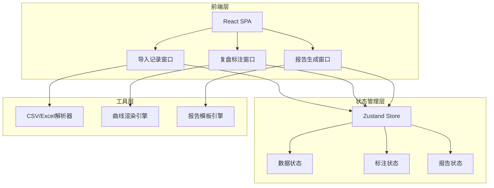

## 1. 架构设计



## 2. 技术说明

- **前端**：React@18 + TypeScript + Tailwind CSS@3 + Vite
- **初始化工具**：vite-init
- **后端**：无（纯前端桌面工具，数据存储于浏览器内存/localStorage）
- **数据库**：无（使用localStorage持久化复盘项目数据）
- **图表库**：Recharts（轻量React图表库，适合时序曲线渲染）
- **文件解析**：PapaParse（CSV解析）、SheetJS/xlsx（Excel解析）
- **PDF导出**：html2canvas + jsPDF
- **状态管理**：Zustand

## 3. 路由定义

| 路由 | 用途 |
|------|------|
| / | 应用首页，重定向至导入记录窗口 |
| /import | 导入记录窗口：数据导入与参数录入 |
| /review | 复盘标注窗口：曲线浏览与异常标注 |
| /report | 报告生成窗口：模板选择与报告导出 |

## 4. API定义

无后端API，所有数据在前端处理和存储。

## 5. 服务端架构图

不适用（纯前端应用）

## 6. 数据模型

### 6.1 数据模型定义

```mermaid
erDiagram
    "项目 Project" ||--o{ "设备记录 DeviceRecord" : "包含"
    "项目 Project" ||--|| "运输参数 TransportParams" : "关联"
    "项目 Project" ||--o{ "异常标注 Annotation" : "包含"
    "项目 Project" ||--o{ "复盘报告 Report" : "生成"

    "项目 Project" {
        string "id PK"
        string "项目名称"
        string "货品类型"
        string "创建时间"
        string "更新时间"
    }

    "设备记录 DeviceRecord" {
        string "id PK"
        string "项目_id FK"
        string "时间戳"
        float "温度"
        float "湿度"
        boolean "门开关"
        float "纬度"
        float "经度"
    }

    "运输参数 TransportParams" {
        string "id PK"
        string "项目_id FK"
        float "温区下限"
        float "温区上限"
        string "货品类型"
        string "起运港"
        string "目的港"
        string "装车时间"
        string "卸货时间"
    }

    "异常标注 Annotation" {
        string "id PK"
        string "项目_id FK"
        string "异常类型"
        string "开始时间"
        string "结束时间"
        float "持续时长"
        string "判定依据"
    }

    "复盘报告 Report" {
        string "id PK"
        string "项目_id FK"
        string "模板类型"
        float "超限总时长"
        float "最大偏差值"
        int "异常次数"
        string "责任阶段"
        string "处理建议"
    }
```

### 6.2 数据定义语言

使用TypeScript接口定义：

```typescript
interface Project {
  id: string;
  name: string;
  cargoType: CargoType;
  createdAt: string;
  updatedAt: string;
}

type CargoType = 'frozen_meat' | 'vaccine_raw' | 'seafood' | 'other';
type AnomalyType = 'insufficient_precool' | 'yard_power_outage' | 'door_seal_check' | 'prolonged_door_open' | 'equipment_false_alarm';
type ReportTemplate = 'customer' | 'internal_ops' | 'claims';

interface DeviceRecord {
  timestamp: string;
  temperature: number;
  humidity: number;
  doorOpen: boolean;
  latitude: number;
  longitude: number;
}

interface TransportParams {
  tempLower: number;
  tempUpper: number;
  cargoType: CargoType;
  originPort: string;
  destPort: string;
  loadTime: string;
  unloadTime: string;
}

interface Annotation {
  id: string;
  type: AnomalyType;
  startTime: string;
  endTime: string;
  duration: number;
  basis: string;
}

interface ReportData {
  templateType: ReportTemplate;
  exceedDuration: number;
  maxDeviation: number;
  anomalyCount: number;
  responsibilityStage: string;
  recommendations: string;
}
```
